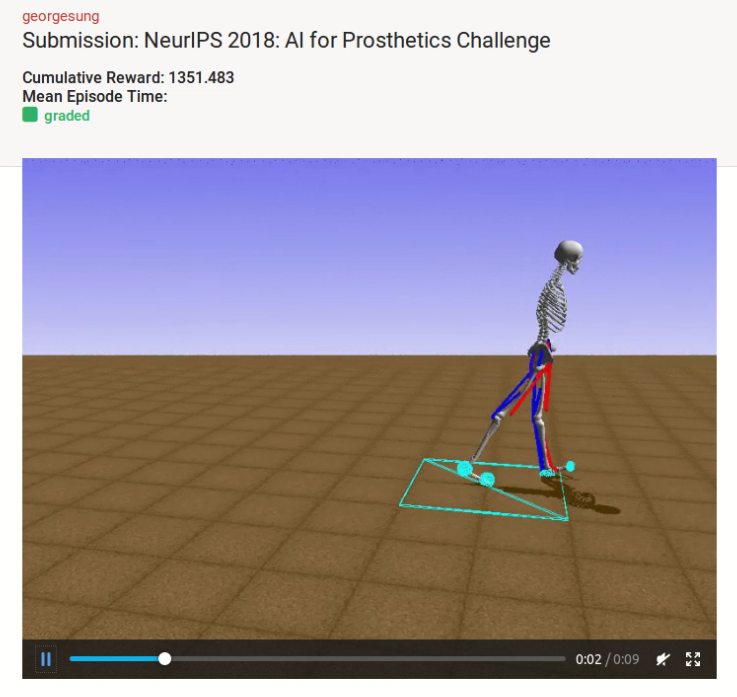
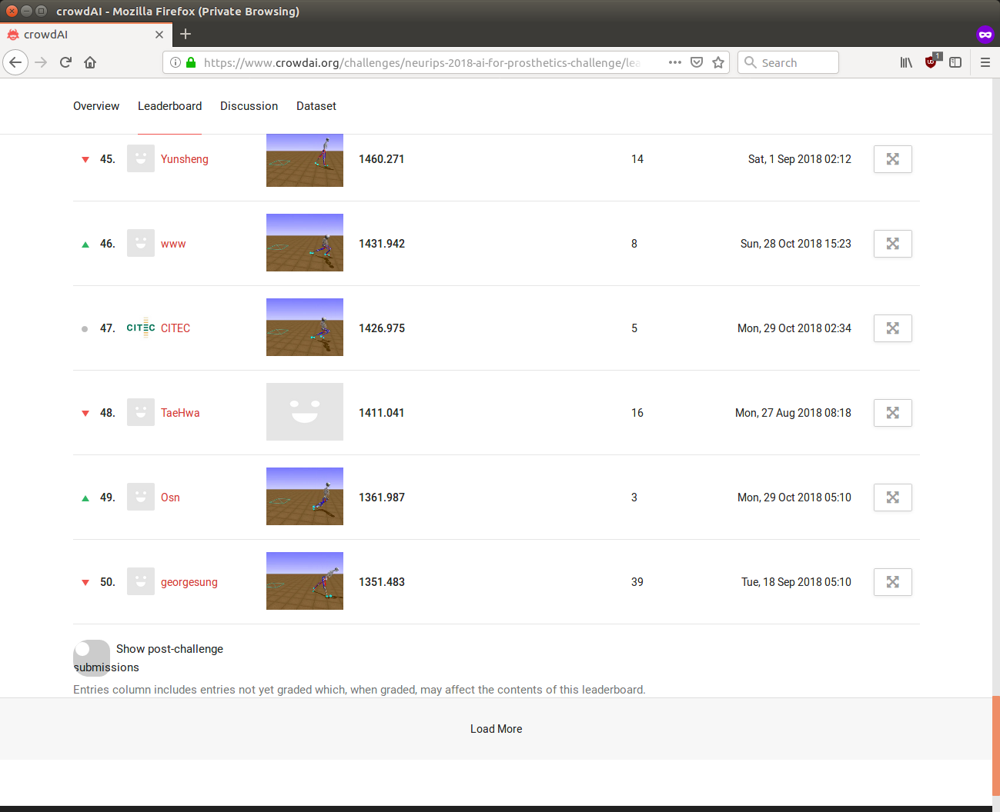

# NeurIPS 2018: AI for Prosthetics Challenge

This is the codebase for my entry into the [NeurIPS 2018: AI for Prosthetics Challenge](https://www.crowdai.org/challenges/neurips-2018-ai-for-prosthetics-challenge). The goal is to learn how to control simulated human muscles to learn how to walk with a prosthetic leg, using reinforcement learning.

Here is a video of an agent I trained using the DDPG reinforcement learning algorithm:  
[https://youtu.be/c4vT1WvYUys](https://youtu.be/c4vT1WvYUys)



## Competition results
Ultimately, I placed number 50 out of 432 participants in round 1 (see [official leaderboard](https://www.crowdai.org/challenges/neurips-2018-ai-for-prosthetics-challenge/leaderboards?challenge_round_id=47)).



I used vanilla [DDPG](https://arxiv.org/abs/1509.02971) from the package/framework [RLlib](https://ray.readthedocs.io/en/latest/rllib.html). The video [linked previously](https://youtu.be/c4vT1WvYUys) shows my agent during evaluation.

Unfortunately, I did not clip my action values between 0 and 1 on the agent side (the rules *did* specify this), and on the environment side they did not clip the action values either, for round 1. So after getting good results in round 1, later in round 2, the competition organizers decided to clip the action values on the environment side. Due to other commitments, it was too late for me to retrain all my models for round 2, so I decided not to participate in round 2.

## Dependencies
To run the code on your local machine, please use python 3.6, and install the python packages specified in 'requirements.txt':  
`pip install -r requirements.txt`  
Note 'requirements.txt' is probably a superset of what you need, but it is included here for completeness.

Alternatively, you can use my Docker image: 'docker.io/georgesung/nips2018_prosthetics':  
`docker pull georgesung/nips2018_prosthetics:latest`

## Notation
In the subsequent sections:
* $DOCKER_IMAGE denotes the Docker image name, e.g. 'georgesung/nips2018_prosthetics:latest'
* $PROJECT_NAME denotes the project name on [Google Cloud](https://cloud.google.com/)
* $SERVICE_ACCOUNT denotes the IAM account you want to use on Google Cloud

## Running in Docker
Example command:  
`docker run -v $PWD:/home/work --shm-size 16G -it $DOCKER_IMAGE bash`

## Training
### Local machine
To train the DDPG model I used for my round 1 submission:
```
ln -s configs configs/ddpg.yaml train.yaml
python train.py
```

To train an example PPO agent:
```
ln -s configs configs/ppo.yaml train.yaml
python train.py
```
However, I found that PPO tends to get stuck in a local optimum, e.g. always falls forward face-first.

To resume training from a previous run, update "load_prev_agent" in the yaml file.

### On Google Cloud
It may be helpful to run multiple simultaneous experiments to try different combinations of hyper-parameters, different reward functions, different environment downsampling rates, etc. In this use case, being able to spawn multiple VMs in the cloud with your experiment configurations is extremely useful. To do so:

- Archive your latest code: `source tar.cmd`. Then upload the resulting code.tar.gz somewhere in your Google Cloud Storage. You also want to upload your experiment config files to Google Cloud Storage.
- Update the following variables in gen_gcloud_cmd.py: NUM_CFGS, INSTANCE_NAME_BASE, BUCKET, CODE_TAR, CFG_BASE. Then run the script: `python gen_cloud_cmd.py`. This script will generate the command you can run to kick off different experiments on Google Cloud -- the command will be in the file 'gcloud_cmd'.
- Make sure the following environment variables are set appropriately: $DOCKER_IMAGE, $PROJECT_NAME, $SERVICE_ACCOUNT. For more details, see "Notation" section above, and gcloud_cmd.template.
- `source gcloud_cmd`.


## Inference
### (Optional) Download pre-trained DDPG model
You can download my pre-trained DDPG model that I used to submit to round 1 [here](https://drive.google.com/file/d/1GUn8vF5bzX7OyB3UBu2sY5TZd-V90FbJ/view?usp=sharing)

Since I used an older (competition round 1) version of the environment, the results I obtained may not be what you obtain if you use the latest version of the environment. However, if you run inference in the Docker container, you should get the same/similar results as me.

### Run inference/evaluation
Assuming your trained model is stored in exp_out, and you want to run inference on the model saved after episode 1609, and the config file you used for agent training was $AGENT_YAML:  
`python test.py --checkpoint exp_out/checkpoint-1609 --expyaml $AGENT_YAML --loops 3 --visualize`

If you're running in the Docker container, you may not be able to visualize the agent. In that case, you can run without the '--visualize' flag:  
`python test.py --checkpoint exp_out/checkpoint-1609 --expyaml $AGENT_YAML --loops 3`
